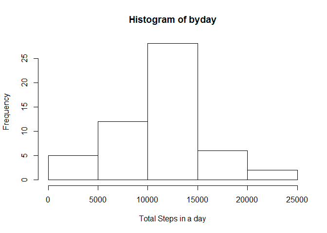
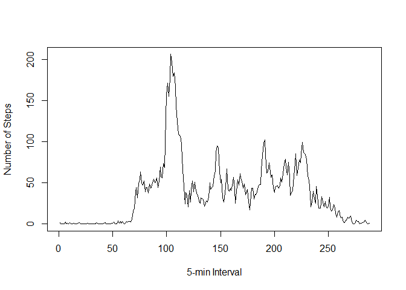
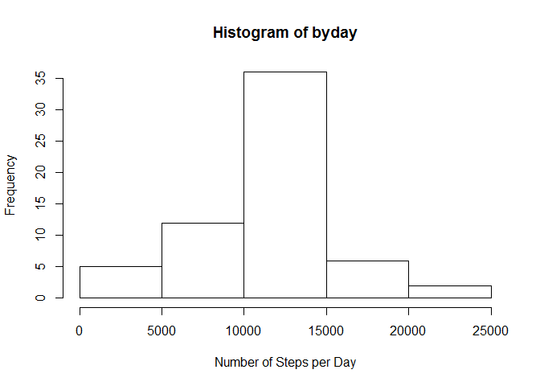
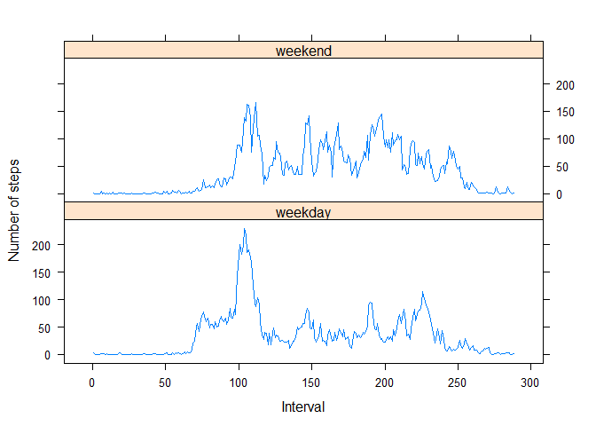

# Reproducible Research: Peer Assessment 1


## Loading and preprocessing the data

The code is loaded into a data frame object called "activitydata".

```r
activitydata <- read.csv("C:/Users/Dora/gitRepos/rprogramming/cl5wk2/activity.csv")
```
The data set is reasonably tidy with 3 columns of data and needs no further processing to get started. 

```r
head(activitydata)
```

```
##   steps       date interval
## 1    NA 2012-10-01        0
## 2    NA 2012-10-01        5
## 3    NA 2012-10-01       10
## 4    NA 2012-10-01       15
## 5    NA 2012-10-01       20
## 6    NA 2012-10-01       25
```
The data set includes 17568 observations.

```r
dim(activitydata)
```

```
## [1] 17568     3
```


## What is mean total number of steps taken per day?

The sum for each day is calculated and stored in the object "byday".

```r
byday <- by(activitydata$steps, activitydata$date, sum)
head(byday)
```

```
## activitydata$date
## 2012-10-01 2012-10-02 2012-10-03 2012-10-04 2012-10-05 2012-10-06 
##         NA        126      11352      12116      13294      15420
```

```r
dim(byday)
```

```
## [1] 61
```
Ignoring the missing values for now, a histogram is plotted.

```r
hist(byday, xlab="Total Steps in a day")
```

 


The mean and median of these total number of steps per day are reported below.

```r
mean(byday, na.rm=TRUE)
```

```
## [1] 10766.19
```

```r
median(byday, na.rm=TRUE)
```

```
## [1] 10765
```

## What is the average daily activity pattern?

A vector "internalvector" of numbers 1 through 288 is formed and binded to "activitydata" such that the numbers will repeat as needed to fill in the new column. This numbers the 288 five-minute intervals present for each day.

```r
#Get vector for 1:288
intervalvector<-1:288
activitydata<-cbind(activitydata,intervalvector)
```
The "by" function is used to calculate the mean for each of the 288 intervals.

```r
byinterval <- by(activitydata$steps, activitydata$intervalvector, mean, na.rm=TRUE)
```
These values are plotted to show an average activity pattern in a day

```r
plot(byinterval, ylab="Number of Steps", xlab = "5-min Interval", type="l")
```

 
The maximum average number of steps taken per day is 206.1698113 and the interval number corresponding is 104. If this course's syllabus accurately reflected the time investment needed per week, I'd tell you the time that corresponds to that interval number.

```r
max(byinterval)
```

```
## [1] 206.1698
```

```r
which.max(byinterval)
```

```
## 104 
## 104
```
## Imputing missing values

The number of missing values in this data set is reported below.

```r
booleanofnas <- is.na(activitydata$steps)
sum(booleanofnas)
```

```
## [1] 2304
```
The strategy for filling in missing values will be to fill them in with means for that time interval. Median is not as good of a strategy here because there are many zeroes in this data set and that reflects a resting state as opposed to a continuous variation of number of steps.

The object "meanbyinterval" is found using the "by" function and converting the resulting object to a vector.

```r
meanbyinterval <- by(activitydata$steps, activitydata$intervalvector, mean, na.rm=TRUE)
meanbyinterval <- as.vector(meanbyinterval)
```
This vector is bound to "activitydata" to make the code for replacing the missing values easier. The default behavior of r will again be to repeat this data as needed to fill in the column.

```r
activitydata<-cbind(activitydata, meanbyinterval)
```
The each observation is  visited using a "for" loop, then tested to see if the value is missing and a replacement is made from the "meanbyinterval" data if so.

```r
for (i in 1:length(booleanofnas))
  {
    if (booleanofnas[i])
     {
      activitydata$steps[i] <- activitydata$meanbyinterval[i]
      }
    }
```

This data is used in a new histogram.

```r
byday <- by(activitydata$steps, activitydata$date, sum)
head(byday)
```

```
## activitydata$date
## 2012-10-01 2012-10-02 2012-10-03 2012-10-04 2012-10-05 2012-10-06 
##   10766.19     126.00   11352.00   12116.00   13294.00   15420.00
```

```r
dim(byday)
```

```
## [1] 61
```

```r
hist(byday, xlab="Number of Steps per Day")
```

 
The mean and median are also reported. These values are very similar to the data from the first part of the assignment. Replacing the missing values had very little impact. This was expected because the data has a very normal distribution and the strategy chosen was to use the mean.

```r
mean(byday, na.rm=TRUE)
```

```
## [1] 10766.19
```

```r
median(byday, na.rm=TRUE)
```

```
## [1] 10766.19
```

## Are there differences in activity patterns between weekdays and weekends?

```r
  dayofweek<-weekdays(as.Date(activitydata$date))
 activitydata<-cbind(activitydata, dayofweek)
```
The day of the week is found using the weekdays function and and if statement is used to assign each day to one of two factors, "weekend" or "weekday".

```r
weekdayOrWeekend <-factor(c("weekday",  "weekend"))
activitydata<-cbind(activitydata,weekdayOrWeekend)
class(activitydata$weekdayOrWeekend)
```

```
## [1] "factor"
```

```r
for(i in 1:length(activitydata$dayofweek))
  {
  if((activitydata$dayofweek[i] == "Saturday") | (activitydata$dayofweek[i] == "Sunday"))
    {
    #message("inside if statement")
    activitydata$weekdayOrWeekend[i] <- "weekend"

    } else {
      activitydata$weekdayOrWeekend[i] <- "weekday"
    }
  }
```
The data is split into subsets so the mean can be calculated for each interval with weekdays and weekend days separated.


```r
subsets<-split(activitydata, activitydata$weekdayOrWeekend,drop=TRUE)
weekdaydata<-subsets[["weekday"]]
weekenddata<-subsets[["weekend"]]
weekdaybyinterval <- by(weekdaydata$steps, weekdaydata$intervalvector, mean)
weekendbyinterval <- by(weekenddata$steps, weekenddata$intervalvector, mean)
```
Needed conversion  to data frames is made.

```r
weekdaybyinterval<-data.frame(as.vector(weekdaybyinterval))
weekendbyinterval<-data.frame(as.vector(weekendbyinterval))
```
Each data frame is given a new column indicating whether an interval corresponds to a weekday or weekend day.

```r
dayofweek<-"weekend"
weekendbyinterval$dayofweek<-dayofweek
weekendbyinterval$intervalvector<- intervalvector


dayofweek<-"weekday"
weekdaybyinterval$dayofweek<-dayofweek
weekdaybyinterval$intervalvector<-intervalvector
```
Simpler column names are assigned as needed.

```r
names(weekendbyinterval)[names(weekendbyinterval)=="as.vector.weekendbyinterval."] <- "steps"
names(weekdaybyinterval)[names(weekdaybyinterval)=="as.vector.weekdaybyinterval."] <- "steps"
names(weekendbyinterval)
```

```
## [1] "steps"          "dayofweek"      "intervalvector"
```

```r
names(weekdaybyinterval)
```

```
## [1] "steps"          "dayofweek"      "intervalvector"
```
These data frames are combined into a single object "bothfactorsdata".

```r
bothfactorsdata<-rbind(weekendbyinterval,weekdaybyinterval)
head(bothfactorsdata)
```

```
##         steps dayofweek intervalvector
## 1 0.214622642   weekend              1
## 2 0.042452830   weekend              2
## 3 0.016509434   weekend              3
## 4 0.018867925   weekend              4
## 5 0.009433962   weekend              5
## 6 3.511792453   weekend              6
```

```r
tail(bothfactorsdata)
```

```
##         steps dayofweek intervalvector
## 571 3.0360587   weekday            283
## 572 2.2486373   weekday            284
## 573 2.2402516   weekday            285
## 574 0.2633124   weekday            286
## 575 0.2968553   weekday            287
## 576 1.4100629   weekday            288
```
The lattice package is used to plot weekday and weekend data.

```r
require(lattice)
```

```
## Loading required package: lattice
```

```r
xyplot(steps ~ intervalvector| dayofweek, 
           data = bothfactorsdata,
           type = "l",
           xlab = "Interval",
           ylab = "Number of steps",
           layout=c(1,2))
```

 
This shows a higher level of activity and more intense activity for weekdays over weekend days.
